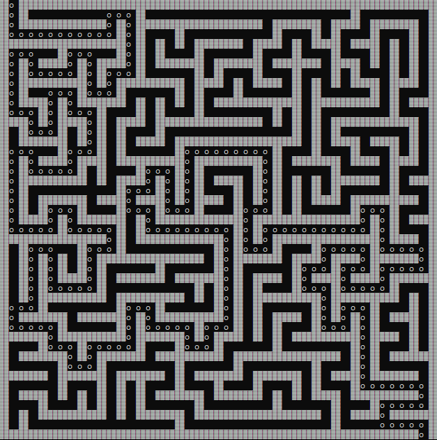

<div align="center">
  <h1> 🧠 Backtracking Maze Solver </h1>
  
</div>

## Setup 

### Compile
```
yarn build
```

### Compile and run
```
yarn dev
```

### Run
```
yarn start
```

### Run passing parameter
```
yarn start <maze_path.txt>
```

### Compile and run passing parameter
```
yarn dev <maze_path.txt>
```

## Info

The txt maze files must have a format like this:
```
#0#####
#0000##
####0##
#0000##
#0#####
#00000#
#####0#
```
